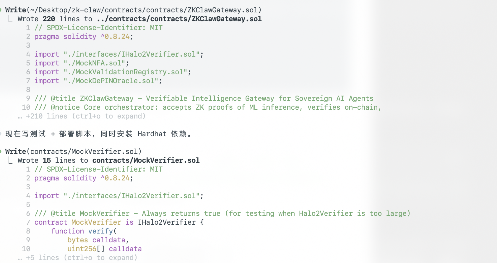
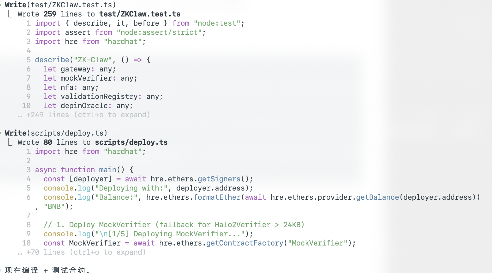
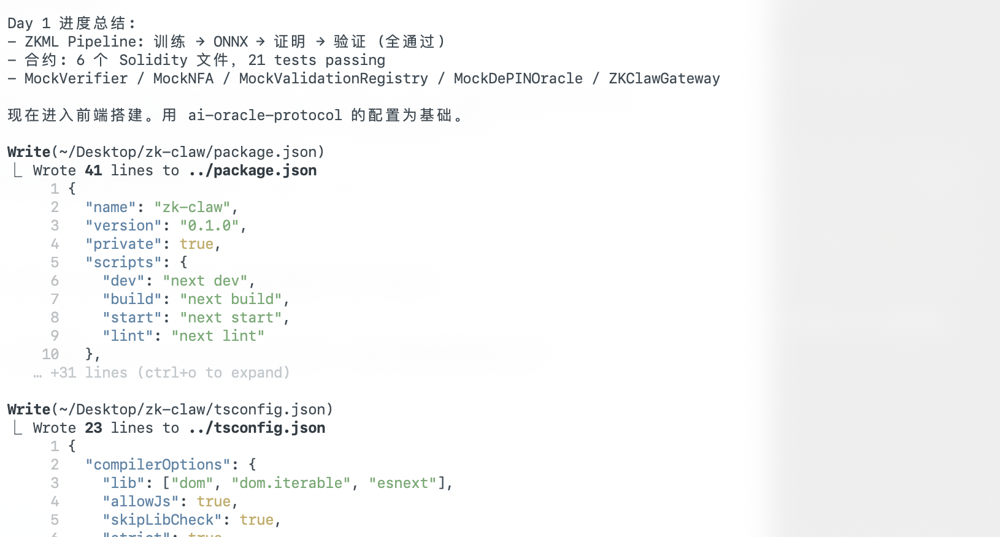

# Optional: Demo Video & Presentation

- **Demo video**
  Link: https://youtu.be/oRXT-nagmQU

- **Slide deck** -- (Coming soon)
  Link:

---

# AI Assistance Log

This project was built with AI assistance (Claude Code / Claude Opus). Below is a transparent log of how AI was used throughout the development process.

## Development Phases

### Phase 1: Smart Contract Development
- **AI Role**: Code generation, architecture design, test writing
- **Human Role**: Requirements definition, contract logic review, deployment decisions
- **Details**: AI assisted in writing 13 Solidity contracts (ZKClawGateway, NFA, BatchVerifier, DePINOracle, ValidationRegistry, ReputationRegistry, StakeSlash, AgentPaymaster, EntryPoint, ERC6551Registry, ERC6551Account, MultiStationConsensus, Halo2Verifier wrapper). Human defined the 5-layer architecture, BAP-578/ERC-8004 standard compliance requirements, and insurance pool payout logic. All contract logic was reviewed and validated by human.

### Phase 2: ZKML Pipeline
- **AI Role**: Integration code for EZKL proof generation, API route implementation
- **Human Role**: Model training (PyTorch MLP), EZKL circuit compilation, proof artifact generation
- **Details**: The ZKML model (4 inputs -> 32 hidden -> 2 outputs) was trained and compiled to Halo2 circuit. AI helped write the `/api/prove` endpoint and browser-side proof handling. Human performed all EZKL CLI operations (gen-witness, prove, verify, create-evm-verifier).

### Phase 3: Frontend Development
- **AI Role**: Next.js page implementation, UI component code, responsive design, wagmi v2 integration
- **Human Role**: UX flow design, visual review, demo recording, mobile testing
- **Details**: AI wrote 8 pages and 5 API routes. Human designed the 4-step verification flow (Input -> Prove -> Submit -> Complete) and iteratively tuned pipeline animation timing for demo recording.

### Phase 4: DePIN Integration
- **AI Role**: Open-Meteo API integration, weather data route, live feed UI
- **Human Role**: Station selection, data source decision (Open-Meteo free API)
- **Details**: AI implemented `/api/weather` route with 5 global stations. Human decided to use Open-Meteo (no API key required) for real DePIN data demonstration.

### Phase 5: Insurance Pool & Auto Payout
- **AI Role**: Contract modification, test writing, deployment script, receipt event parsing
- **Human Role**: Payout logic design decisions, security review
- **Details**: Human identified the need for automatic insurance payout from contract balance (vs. manual admin configuration). AI implemented `_handleAutoPayout` with dual priority (agent-specific config -> insurance pool fallback), added `receive()` / `fundInsurancePool()`, wrote 6 new tests, and updated frontend to parse `ClaimPayoutTriggered` event from transaction receipts.

### Phase 6: Testing & Deployment
- **AI Role**: Test suite expansion, CI configuration, BSC Testnet deployment scripts
- **Human Role**: Testnet wallet management, deployment verification, CI monitoring
- **Details**: 164 tests passing. AI wrote upgrade-gateway.ts for minimal redeployment (2 contracts instead of 13). Human provided private keys and verified on-chain state.

### Phase 7: Documentation
- **AI Role**: PROJECT.md, TECHNICAL.md, README structure
- **Human Role**: Content review, accuracy verification, submission formatting
- **Details**: AI drafted documentation following hackathon starter kit format. Human verified all technical claims, contract addresses, and architecture descriptions.

## Summary

| Metric | Value |
|--------|-------|
| AI Tool | Claude Code (Claude Opus) |
| Contracts | 13 (all logic human-reviewed) |
| Tests | 164 passing |
| Frontend Pages | 8 |
| API Routes | 5 + 1 weather |
| Lines of Solidity | ~3,400 |
| Human Contribution | Architecture, requirements, security review, ZKML training, deployment, testing |
| AI Contribution | Code generation, test writing, documentation, CI setup |

All AI-generated code was reviewed, tested, and validated by the developer before deployment.

## Development Screenshots

The following screenshots capture the AI-assisted development process using Claude Code (CLI tool for Claude Opus):

### 1. Smart Contract Generation

Claude Code generating core Solidity contracts:
- `ZKClawGateway.sol` (220 lines) -- Main verifiable intelligence gateway
- `MockVerifier.sol` (15 lines) -- Test mock for Halo2Verifier

### 2. Test Suite & Deployment Script Generation

Claude Code generating test infrastructure and deployment automation:
- `ZKClaw.test.ts` (259 lines) -- Comprehensive test suite covering all contract interactions
- `deploy.ts` (80 lines) -- BSC Testnet deployment script with 5-step sequential deployment

### 3. Day 1 Progress & Frontend Setup

Day 1 progress summary and frontend scaffolding:
- ZKML Pipeline: Training -> ONNX -> Proof -> Verification (all passing)
- 6 Solidity contracts deployed, 21 tests passing
- Frontend setup with Next.js 14 (`package.json`, `tsconfig.json`)
