# ZK-Claw: Verifiable Intelligence Gateway for AI Agents on BNB Chain

## 1. Problem

AI Agents are increasingly making autonomous on-chain decisions across DeFi trading, insurance claims, supply chain verification, and other critical applications. However, there's no way to verify their reasoning or ensure their data sources are authentic:

- **Black Box Operations**: Current AI agents operate as opaque systems where users must blindly trust the model output without any proof of correct execution
- **Data Source Manipulation**: Data sources feeding AI agents can be spoofed or manipulated, leading to incorrect decisions based on false information
- **Zero Accountability**: No mechanism exists to hold AI agents accountable for misbehavior or faulty decisions on-chain
- **Systemic Risk**: This is critical because billions of dollars will flow through AI agent decisions in the near future

The fundamental issue is the absence of cryptographic guarantees for both computational correctness (did the AI model run as claimed?) and data authenticity (is the input data from a legitimate source?).

## 2. Solution

ZK-Claw is a verifiable intelligence gateway that ensures every AI agent decision is cryptographically provable and hardware-authenticated. It provides dual trust verification through a 5-layer architecture:

### Architecture Overview

```mermaid
graph TD
    A[Layer 1: DePIN Capture] -->|Hardware-signed data| B[Layer 2: ZKML Inference]
    B -->|ZK proof + public instances| C[Layer 3: Agent Assembly]
    C -->|Transaction bundle| D[Layer 4: On-Chain Verify]
    D -->|Verification result| E[Layer 5: Settlement]

    A1[Weather Station<br/>Device Auth] --> A
    B1[EZKL Prover<br/>Halo2 Proof] --> B
    C1[Agent TBA<br/>Proof + Params] --> C
    D1[ZKClawGateway<br/>Verify & Record] --> D
    E1[Reputation Update<br/>Event Emission] --> E

    style A fill:#2d3748
    style B fill:#2d3748
    style C fill:#2d3748
    style D fill:#2d3748
    style E fill:#2d3748
```

### 5-Layer Pipeline

**Layer 1 - DePIN Capture**: Hardware-signed data from physical sensors (weather stations, IoT devices) with device authentication. Each sensor has a registered device ID and cryptographic signature capability.

**Layer 2 - ZKML Inference**: EZKL generates Halo2 ZK proofs that the ML model ran correctly on the given inputs. The proof guarantees computational integrity without revealing model weights or sensitive input data.

**Layer 3 - Agent Assembly**: Transaction parameters are packaged with the ZK proof, public instances (model inputs/outputs), agent ID, and station ID into a verifiable bundle.

**Layer 4 - On-Chain Verify**: ZKClawGateway contract verifies the ZK proof and device signature on BSC, recording the verification result immutably on-chain.

**Layer 5 - Settlement**: Verification is recorded, agent reputation is updated, and downstream protocols can execute actions based on verified intelligence.

### Key Differentiator

**Dual Trust Verification**: Unlike pure ZKML solutions (only prove inference correctness) or pure DePIN solutions (only prove data source authenticity), ZK-Claw combines both:
- ZK Proof verifies the AI model executed correctly
- DePIN Hardware Signature verifies data came from an authenticated physical device

This creates an end-to-end trust chain from physical world to on-chain execution.

### Technical Stack

- **ZKML**: EZKL (Halo2 proof system) for verifiable ML inference
- **Smart Contracts**: Hardhat 3, Solidity 0.8.24, 13 deployed contracts (107 tests passing)
- **Frontend**: Next.js 14, wagmi v2, Reown AppKit
- **Network**: BNB Smart Chain Testnet
- **Standards**: BAP-578 (NFA), ERC-8004 (Validation), ERC-6551 (TBA), ERC-4337 (AA)

### Demo Implementation

The current demo showcases a parametric weather insurance use case:
- DePIN oracle fetches live weather data from 5 global stations (Open-Meteo API)
- EZKL proves correct execution of weather prediction model (Halo2 SNARK)
- CLAIM is triggered when 2+ of these thresholds are exceeded: |T| > 35°C, humidity > 90%, wind > 80 km/h, rainfall > 150mm
- Agent submits verifiable proof on-chain via ZKClawGateway
- On CLAIM decision, real insurance payout (0.001 BNB) is sent to Agent's Token Bound Account (ERC-6551)
- All verification steps and payouts are recorded on-chain for auditability

## 3. Business & Ecosystem Impact

### Target Market

Any protocol deploying AI agents on BNB Chain across multiple verticals:
- **DeFi**: Verifiable trading strategies, risk assessment models
- **Insurance**: Parametric insurance triggers, claims verification
- **Supply Chain**: Product quality verification, logistics optimization
- **Gaming**: Provably fair AI opponents, dynamic difficulty adjustment

### Integration Model

ZK-Claw functions as an infrastructure layer. Protocols integrate the gateway to make their AI agents verifiable without rebuilding their entire stack. Integration requires:
1. Registering agent NFAs (Non-Fungible Agents per BAP-578)
2. Generating ZKML proofs for agent decisions
3. Submitting proofs through ZKClawGateway for verification

### BNB Chain Ecosystem Alignment

- **AI + DePIN Focus**: Directly supports BNB Chain's strategic push for AI and DePIN infrastructure
- **Developer Tooling**: Provides SDK and standards for builders deploying AI agents
- **Security Layer**: Reduces systemic risk from unverified AI agent actions
- **Composability**: Standards-compliant (BAP-578, ERC-8004) enabling cross-protocol agent interoperability

### Revenue Model

- **Per-Verification Fees**: Base fee for each proof verification (scales with agent adoption)
- **Premium Batch Verification**: Optimized pricing for high-volume agents
- **Enterprise SLA**: Custom verification infrastructure for institutional users
- **Model Marketplace**: Revenue share from ZKML model providers

### Metrics & Success Indicators

- Number of registered agents
- Total verifications processed
- Protocols integrated
- Value secured by verified agent decisions

## 4. Limitations & Future Work

### Current Limitations

**Model Scope**: The current demo uses a weather insurance scenario with a single ONNX model. Production requires support for multiple model architectures (transformers, LLMs, vision models) and dynamic model loading.

**Performance**: EZKL proof generation takes approximately 60 seconds on CPU. GPU acceleration and specialized prover hardware are needed for production-scale throughput.

**Infrastructure**: Demo mode uses pre-generated proofs stored in the repository. Production requires dedicated prover infrastructure with job queuing, caching, and fault tolerance.

**Network Coverage**: Currently deployed only on BSC Testnet. Mainnet deployment requires security audits and economic modeling.

### Roadmap

**Phase 1 (Q2 2026)**: Mainnet Deployment
- Security audit of all smart contracts
- Prover infrastructure with GPU acceleration
- Mainnet deployment on BNB Chain
- SDK release for agent developers

**Phase 2 (Q3 2026)**: Model Marketplace
- Support for multiple ML frameworks (PyTorch, TensorFlow, JAX)
- Model registry for ZKML-compatible models
- Developer tools for converting models to EZKL format
- Proof caching and aggregation for cost optimization

**Phase 3 (Q4 2026)**: Multi-Chain Expansion
- Cross-chain proof verification (Ethereum, Polygon, Arbitrum)
- Unified agent identity across chains
- Cross-chain reputation system
- Interoperability with other agent protocols

**Phase 4 (2027)**: Enterprise & Compliance
- Regulatory compliance modules (audit trails, KYC/AML)
- Enterprise SLA with guaranteed verification latency
- Privacy-preserving ZKML (private inputs/outputs)
- Integration with traditional enterprise systems

### Research Directions

- **Proof Aggregation**: Batch multiple agent decisions into single proof for cost efficiency
- **Recursive Proofs**: Enable agents to verify other agents' decisions trustlessly
- **Optimistic Verification**: Fast-path execution with fraud proofs for high-throughput scenarios
- **Hardware Co-Processors**: Custom ASIC/FPGA designs for ZKML proof generation

---

**Contact**: GitHub @caohuize111/zk-claw
**Deployment**: BSC Testnet (see bsc.address)
**Network**: BNB Smart Chain Testnet
