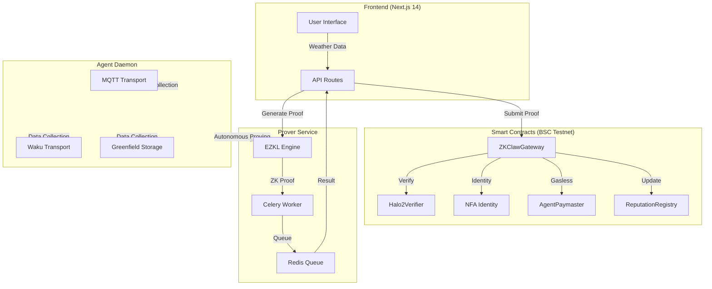
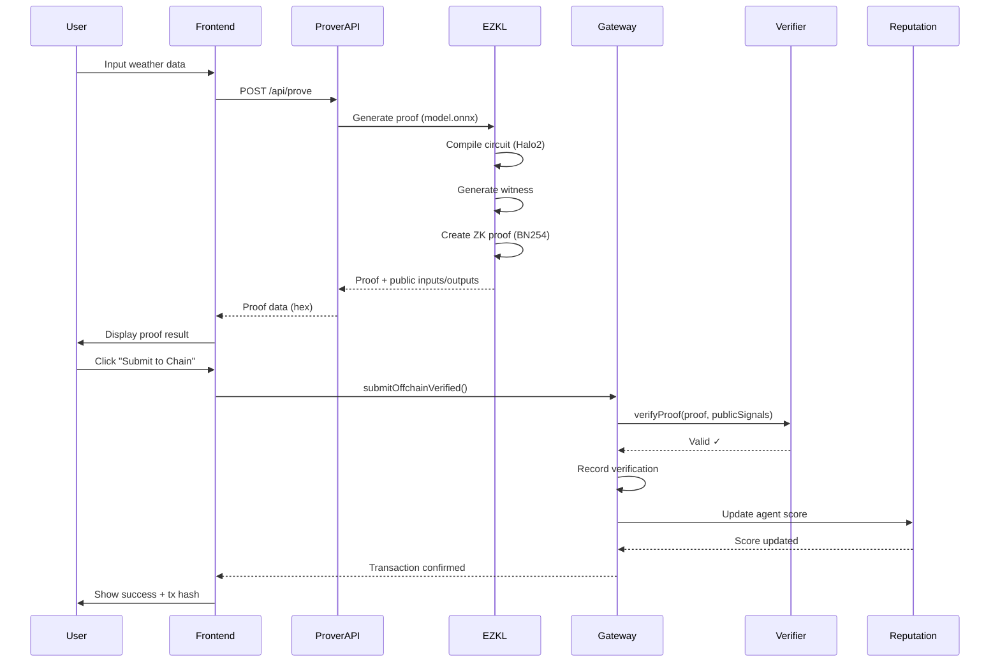

# ZK-Claw Technical Documentation

## Project Overview

ZK-Claw is a Verifiable Intelligence Gateway for AI Agents on BNB Chain. It provides a 5-layer verifiable AI pipeline that enables AI agents to make provably correct decisions using zero-knowledge machine learning (ZKML), backed by decentralized physical infrastructure (DePIN) and non-fungible agent identity (NFA).

## 1. Architecture

### System Overview

ZK-Claw implements a 5-layer verifiable AI pipeline:

1. **Input Layer**: Weather data collection (temperature, humidity, wind speed, precipitation)
2. **ZKML Layer**: PyTorch model converted to ONNX, then to Halo2 circuit via EZKL
3. **Proof Layer**: Zero-knowledge proof generation using BN254 elliptic curve
4. **Verification Layer**: On-chain Halo2 verifier contract validates proof
5. **Action Layer**: Decision execution with reputation/stake updates

### Components

#### Frontend
- **Stack**: Next.js 14 (App Router) + Tailwind CSS + wagmi v2 + Reown AppKit
- **Pages** (8 total):
  - `/` - Home/Landing page
  - `/dashboard` - Agent overview and statistics
  - `/verify` - ZK proof generation interface
  - `/paymaster` - ERC-4337 gasless transactions (AgentPaymaster)
  - `/batch` - Batch verification interface
  - `/agent/[id]` - Agent detail and verification history
  - `/agent/manage` - Agent management interface
- **API Routes** (5 total):
  - `/api/prove` - ZK proof generation endpoint
  - `/api/agents` - Agent registry data
  - `/api/records` - Verification records
  - `/api/history/[id]` - Agent-specific history
  - `/api/sse` - Server-Sent Events for real-time updates

#### Smart Contracts
- **Platform**: BSC Testnet, Solidity 0.8.24, Hardhat 3
- **Deployment**: 13 core contracts (107 tests passing)
- **Contract Categories**:

  **Core Verification**:
  - `ZKClawGateway` - Main entry point for proof submission
  - `Halo2Verifier` - On-chain Halo2 proof verifier
  - `BatchVerifier` - Batch proof aggregation
  - `DePINOracle` - Decentralized sensor data oracle

  **Agent Identity (BAP-578)**:
  - `NFA` - Non-Fungible Agent ERC-721 identity
  - `ERC6551Registry` - Token-bound account registry
  - `ERC6551Account` - Agent wallet implementation

  **Economics**:
  - `AgentPaymaster` - ERC-4337 gasless transaction sponsor
  - `StakeSlash` - Stake management and slashing mechanism
  - `ReputationRegistry` - On-chain reputation scoring

  **Governance**:
  - `ValidationRegistry` - ERC-8004 validation rules registry
  - `MultiStationConsensus` - Multi-station DePIN consensus
  - `EntryPoint` - ERC-4337 account abstraction entry point

#### Agent Daemon
- **Runtime**: Node.js background service
- **Transport Options** (opt-in):
  - MQTT - Lightweight pub/sub messaging
  - Waku - Decentralized privacy-preserving messaging
  - Greenfield - BNB Greenfield decentralized storage integration
- **Features**:
  - Autonomous proof generation scheduling
  - Multi-transport data collection
  - Session isolation for concurrent operations

#### Prover Service
- **Stack**: FastAPI + Celery + Redis
- **Deployment**: Docker Compose (3 services)
  - `prover-api` - REST API server
  - `celery-worker` - Async proof generation worker
  - `redis` - Task queue and result backend
- **Modes**:
  - Demo mode: Browser-based proof generation (no backend needed)
  - VPS mode: Server-side proof generation with Celery task queue

#### ZKML Pipeline
1. **Model Training**: PyTorch neural network (4 inputs → 32 hidden → 2 outputs)
2. **Model Export**: Convert to ONNX format
3. **Circuit Compilation**: EZKL generates Halo2 circuit from ONNX
4. **Proof Generation**: EZKL creates ZK proof with public inputs/outputs
5. **On-chain Verification**: Halo2Verifier validates proof in ~60k gas

### Architecture Diagram



### Data Flow



### On-chain vs Off-chain

**On-chain**:
- Verification records (proof hash, timestamp, decision)
- Agent identity (NFA token ownership)
- Reputation scores (success rate, total verifications)
- Stake/slash balances
- Validation rules (ERC-8004 registry)

**Off-chain**:
- ML model inference (PyTorch)
- ZK proof generation (EZKL + Halo2)
- DePIN data collection (MQTT/Waku/Greenfield)
- Agent daemon scheduling
- SSE real-time updates

### Security Features

1. **Rate Limiting**: 10 requests/minute per session
2. **Input Validation**: Range checks for weather data (temp: -50 to 100°C, humidity: 0-100%, wind: 0-500 km/h, precipitation: 0-1000mm)
3. **Session Isolation**: Each proof generation runs in isolated context
4. **BN254 Field Arithmetic**: Signed comparison using field modulus offset (bias +100)
5. **Proof Immutability**: On-chain proof hashes prevent tampering
6. **Stake-based Security**: Agents stake tokens, slashed on invalid proofs
7. **Multi-signature Governance**: ValidationRegistry controlled by multisig

## 2. Setup & Run

### Prerequisites

- **Node.js**: 18.0 or higher
- **npm**: 9.0 or higher
- **MetaMask**: Browser extension installed
- **BSC Testnet**: tBNB for gas fees
  - Get testnet BNB: https://www.bnbchain.org/en/testnet-faucet
  - Network RPC: https://data-seed-prebsc-1-s1.bnbchain.org:8545
  - Chain ID: 97

### Installation & Build

```bash
# Clone repository
git clone https://github.com/caohuize111/zk-claw.git
cd zk-claw

# Install dependencies
npm install

# Build frontend
npm run build
```

### Contracts (Optional - Already Deployed)

The contracts are already deployed to BSC Testnet. To run tests locally:

```bash
cd contracts
npm install

# Run test suite (107 tests)
npx hardhat test

# Run with gas reporting
REPORT_GAS=true npx hardhat test

# Deploy to BSC Testnet (if needed)
npx hardhat run scripts/deploy.js --network bscTestnet
```

**Deployed Contracts** (BSC Testnet):
- ZKClawGateway: `0x...` (see contracts/deployments/bscTestnet.json)
- Halo2Verifier: `0x...`
- NFA: `0x...`
- Full addresses in `contracts/deployments/bscTestnet.json`

### Prover Service (Optional - Demo Mode Available)

The frontend supports demo mode without running the prover service. For production deployment:

```bash
cd prover-service

# Start services with Docker Compose
docker-compose up -d

# View logs
docker-compose logs -f prover-api

# Stop services
docker-compose down
```

**Services**:
- `prover-api`: FastAPI server on port 8001
- `celery-worker`: Background proof generation worker
- `redis`: Task queue on port 6379

### Run Frontend

```bash
# Development mode
npm run dev

# Production mode
npm run build
npm start

# Open browser
# Navigate to http://localhost:3000
```

### Environment Variables

Create `.env.local` file (optional, has defaults):

```env
# WalletConnect Project ID (optional, has default)
NEXT_PUBLIC_WALLETCONNECT_PROJECT_ID=your_project_id

# Prover service URL (optional, empty = demo mode)
PROVER_SERVICE_URL=http://localhost:8001

# Enable real-time proving (optional, "true" for VPS mode)
ENABLE_REALTIME_PROVE=true

# BSC Testnet RPC (optional, has default)
NEXT_PUBLIC_BSC_TESTNET_RPC=https://data-seed-prebsc-1-s1.bnbchain.org:8545
```

**Configuration Modes**:
- **Demo Mode** (default): No prover service needed, browser-based proof generation
- **VPS Mode**: Set `ENABLE_REALTIME_PROVE=true` and `PROVER_SERVICE_URL`

## 3. Demo Guide

### Access

- **Local**: http://localhost:3000
- **Deployed**: https://zk-claw.vercel.app

### User Flow

#### Step 1: Connect Wallet

1. Click "Connect Wallet" button (top right corner)
2. Select MetaMask from wallet options
3. Approve connection request
4. Ensure network is set to **BSC Testnet** (Chain ID: 97)
   - If wrong network, AppKit will prompt to switch
   - Click "Switch Network" in the prompt

#### Step 2: Generate ZK Proof

1. Navigate to **Verify** page from navigation menu
2. Choose weather data input method:
   - **Preset**: Select from dropdown (e.g., "Extreme Storm", "Heat Wave", "Normal Weather")
   - **Custom**: Enter values manually
     - Temperature: -50 to 50°C
     - Humidity: 0 to 100%
     - Wind Speed: 0 to 200 km/h
     - Precipitation: 0 to 500mm
3. Click **"Generate ZK Proof"** button
4. Watch the 5-layer pipeline execute:
   - Layer 1: Input validation
   - Layer 2: ZKML model inference
   - Layer 3: Proof generation
   - Layer 4: Proof verification (local)
   - Layer 5: Decision extraction
5. Review proof result:
   - **Decision**: NORMAL or CLAIM (insurance payout)
   - **Proof Size**: ~128KB compressed
   - **Verify Time**: ~2-3 seconds
   - **Proof Hash**: Keccak256 hash for on-chain storage

#### Step 3: Submit to Blockchain

1. Click **"Submit to ZKClawGateway"** button
2. Review transaction details in MetaMask popup:
   - Contract: ZKClawGateway
   - Function: `submitOffchainVerified()`
   - Gas estimate: ~200k-300k gas
3. Click **"Confirm"** in MetaMask
4. Wait for transaction confirmation (~3 seconds on BSC Testnet)
5. View success message with transaction hash

#### Step 4: View Results

1. Navigate to **Dashboard** page
2. See updated statistics:
   - Total verifications
   - Success rate
   - Agent reputation score
   - Recent verification records
3. Click on any agent card to view **Agent Detail** page
4. Explore verification history:
   - Timestamp
   - Input data
   - Decision output
   - Proof hash
   - Transaction link (BSCScan)

#### Step 5: Try Batch Verification

1. Navigate to **Batch** page
2. Add multiple weather data entries (up to 10)
3. Click **"Generate Batch Proof"**
4. Review aggregated proof (BatchVerifier)
5. Submit batch transaction (saves gas vs. individual submissions)

#### Step 6: Explore Gasless Transactions

1. Navigate to **Paymaster** page
2. Verify using AgentPaymaster (ERC-4337)
3. Gas fees paid by paymaster contract
4. User signature only, no tBNB required for this transaction

### Troubleshooting

#### Wrong Network
- **Issue**: Wallet connected to wrong network (e.g., Ethereum Mainnet)
- **Solution**: AppKit will automatically prompt to switch to BSC Testnet. Click "Switch Network" button.

#### No tBNB
- **Issue**: Transaction fails with "insufficient funds for gas"
- **Solution**: Get testnet BNB from https://www.bnbchain.org/en/testnet-faucet
  - Enter your wallet address
  - Complete captcha
  - Wait 10-30 seconds for tBNB to arrive

#### Transaction Fails
- **Issue**: Transaction reverts with error
- **Possible causes**:
  - Wrong network: Ensure BSC Testnet is selected
  - Insufficient gas: Increase gas limit in MetaMask (Advanced settings)
  - Invalid proof: Regenerate proof and try again
  - Contract paused: Contact team (unlikely in demo)

#### Proof Generation Slow
- **Issue**: ZK proof generation takes >10 seconds
- **Solutions**:
  - Demo mode uses browser WASM, may be slow on low-spec devices
  - For production, deploy prover service with VPS mode
  - Use batch verification for multiple proofs (amortizes setup cost)

#### Page Not Loading
- **Issue**: Frontend shows 404 or blank page
- **Solutions**:
  - Ensure `npm run dev` or `npm start` is running
  - Check console for build errors
  - Clear Next.js cache: `rm -rf .next` then rebuild

### Example Test Cases

#### Normal Weather (No Claim)
```
Temperature: 20°C
Humidity: 60%
Wind Speed: 15 km/h
Precipitation: 5mm
Expected Decision: NORMAL
```

#### Extreme Storm (Claim Payout)
```
Temperature: -10°C
Humidity: 95%
Wind Speed: 120 km/h
Precipitation: 200mm
Expected Decision: CLAIM
```

#### Heat Wave (Claim Payout)
```
Temperature: 45°C
Humidity: 10%
Wind Speed: 5 km/h
Precipitation: 0mm
Expected Decision: CLAIM
```

## Additional Resources

- **GitHub Repository**: https://github.com/caohuize111/zk-claw
- **Contract Deployments**: See `contracts/deployments/bscTestnet.json`
- **EZKL Documentation**: https://docs.ezkl.xyz
- **BNB Chain Testnet**: https://testnet.bscscan.com
- **ERC-4337 (Account Abstraction)**: https://eips.ethereum.org/EIPS/eip-4337
- **ERC-6551 (Token Bound Accounts)**: https://eips.ethereum.org/EIPS/eip-6551
- **BAP-578 (Non-Fungible Agents)**: BNB Application Sidechain Protocol 578

## System Requirements

### Minimum
- CPU: 2 cores
- RAM: 4GB
- Storage: 2GB available
- Browser: Chrome 90+, Firefox 88+, Safari 14+

### Recommended (VPS Mode)
- CPU: 4 cores
- RAM: 8GB
- Storage: 10GB SSD
- Network: 100 Mbps
- OS: Ubuntu 22.04 LTS

## License

MIT License - see LICENSE file for details
